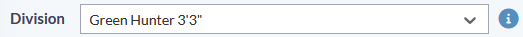

# React-Javascript Tasks Documentation

## Description
This repository contains a collection of tasks that I have encountered and implemented while working on React-Javascript project in IT industry.

This repository serves as a reference for myself and other developers who might find these solutions helpful.

## Table of Contents
- [Description](#description)
- [Table of Contents](#table-of-contents)
- [Tasks](#tasks)
  - [Task 1: How to disable `<i>` tag in React based on some condition ](#task-1-how-to-disable-i-tag-in-react)

## Tasks

### Task 1: How to disable `<i>` tag in React
**Description:**
The task was to disable an `<i>` tag in a React component based on some condition.

**Solution:**
To disable the `<i>` tag, we prevented its click event and added some CSS styles to make it look disabled.

**Code Snippet:**
```jsx
import React from 'react';

const ClassDetail = (props) => {
  const [disableDivision, setDisableDivision] = useState(false); // by default will be false
  
  useEffect(()=>{
    if(props?.parent_area == "Divisions" && (props.id || props.id == 0)){
        if(props?.updatedData?.division_id > 0){ // When opened from division , set class division to that division (only when adding new class in existing division)
            methods.setValue('classes.division_id',props?.updatedData?.division_id ,{shouldDirty:true})
        }

        setDisableDivision(true) // disable class division when opened from exisiting/new divison 
    }
  },[])

  return (
    <i 
        className="fa-sharp fa-solid fa-circle-info fa-xl me-2 py-3" 
        style={{ color: disableDivision ? 'gray' : '#578EBE', cursor: disableDivision ? 'not-allowed' : 'pointer' }} 
        onClick={!disableDivision ? () => getDetailPageInfo(methods.getValues('classes.division_id'), "Divisions", "DivisionDetail") :undefined}
    ></i>
  );
};

```
## Screenshots


